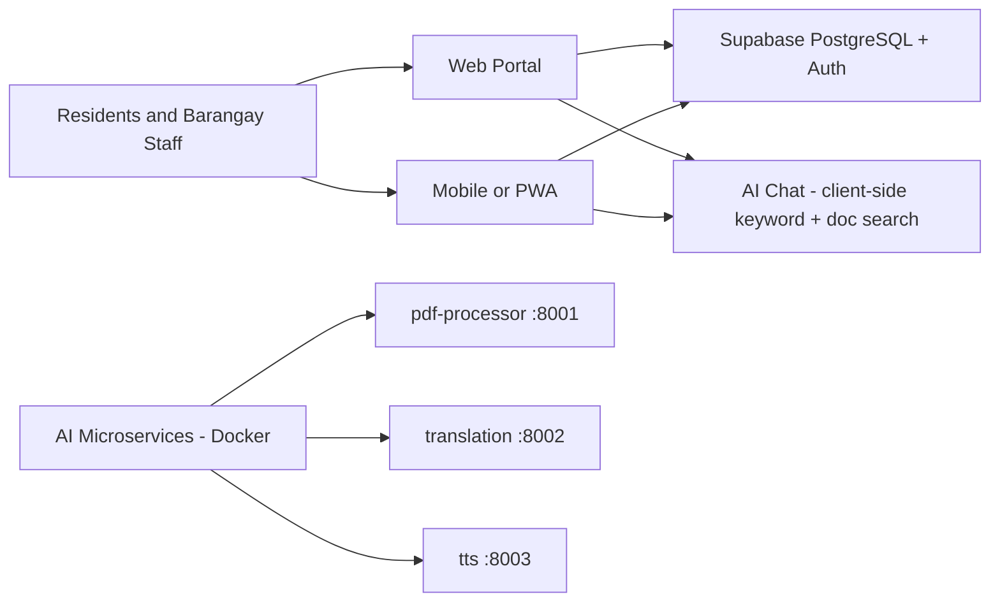

# Barangay AI — Smart Barangay Project Documentation

> **Master documentation for the Barangay AI system** — an AI-powered web and mobile services portal for **Barangay Tandang Sora, Butuan City**.
> This document consolidates the project's architecture, codebase, database, AI services, deployment, and operations into a single reference.

---

## Table of Contents

1. [Project Overview](#1-project-overview)
2. [Current Implementation Status](#2-current-implementation-status)
3. [Repository Structure](#3-repository-structure)
4. [Technology Stack](#4-technology-stack)
5. [System Architecture](#5-system-architecture)
6. [Admin Portal](#6-admin-portal)
7. [Resident PWA](#7-resident-pwa)
8. [Database Schema](#8-database-schema)
9. [AI Microservices](#9-ai-microservices)
10. [Docker & Containerization](#10-docker--containerization)
11. [Environment Configuration](#11-environment-configuration)
12. [Development Setup & Commands](#12-development-setup--commands)
13. [Authentication & Authorization](#13-authentication--authorization)
14. [Security](#14-security)
15. [Testing](#15-testing)
16. [Performance & Reliability](#16-performance--reliability)
17. [Planned & Future Work](#17-planned--future-work)
18. [Reference Documentation](#18-reference-documentation)

---

## 1. Project Overview

**Barangay AI (Smart Barangay)** modernizes resident services at Barangay Tandang Sora by providing:

- **Online service requests** — certificates, clearances, permits, and document submissions with status tracking.
- **AI-assisted information** — a chat assistant that answers questions from approved barangay policies, FAQs, ordinances, and service guides.
- **Administrative workflows** — a staff dashboard for resident records, document requests, complaints, business permits, announcements, and reporting.
- **Mobile-first resident experience** — a Progressive Web App (PWA) that works on low-bandwidth mobile connections.

The platform is designed around **government service workflows** rather than generic ticketing. Residents interact with a simplified, mobile-friendly portal while staff receive structured queues, verification controls, and role-based permissions. AI answers are grounded in approved knowledge-base content so the assistant never gives unsupported guidance.

---

## 2. Current Implementation Status

> **Important:** This section is a reality-check of what is actually implemented in the repository today. Several design documents in `docs/` describe a larger planned system.

| Area | Status |
| --- | --- |
| `apps/admin-portal` | **Implemented** — Next.js 14 dashboard with ~20 routes; residents, documents, community, cases, business, communication modules. Some admin pages are UI stubs (users, roles, settings, reports). |
| `apps/resident-pwa` | **Implemented** — Next.js 14 mobile-first PWA with home, requests, announcements, AI chat, profile, and 4-step registration. |
| `apps/api` (FastAPI gateway) | **NOT implemented** — documented in `docs/` but the directory does not exist. Both frontends talk directly to Supabase. |
| `packages/shared-types` | **Implemented** — shared TypeScript contracts (not yet consumed by the apps). |
| `services/ai/pdf-processor` | **Implemented** — FastAPI service using OpenDataLoader for PDF extraction. Fully tested. |
| `services/ai/translation` | **Implemented** — FastAPI service using CTranslate2 + Lingvanex models (en ↔ ceb and 10 more). Fully tested. |
| `services/ai/tts` | **Implemented** — FastAPI service using F5-TTS text-to-speech. Fully tested. |
| Database | **Implemented** — `supabase_schema.sql` defines the full schema; RLS only on `chat_messages`. |
| AI ↔ frontend integration | **Not wired** — the three Python services exist but no app calls them. The resident AI chat is a client-side keyword-matching engine over policy documents. |
| Firebase push notifications, LangChain RAG, pgvector, Alembic | **Planned only** — described in docs, not implemented. |
| Mock mode | Both apps fall back to an in-memory mock Supabase client when the real connection is a placeholder URL, so the whole stack runs without a live database. |

---

## 3. Repository Structure

```text
.
├── apps/
│   ├── admin-portal/          # Barangay staff dashboard (Next.js 14, port 3000)
│   └── resident-pwa/          # Resident mobile PWA (Next.js 14, port 5173)
├── packages/
│   └── shared-types/          # Shared TypeScript contracts
├── services/
│   └── ai/
│       ├── pdf-processor/     # PDF extraction service (FastAPI, port 8001)
│       ├── translation/       # Language translation service (FastAPI, port 8002)
│       └── tts/               # Text-to-speech service (FastAPI, port 8003)
├── scripts/
│   └── setup_ai_venvs.py      # Python venv bootstrap for AI services
├── components/layout/         # Root-level (legacy/unused) admin sidebar
├── docs/                      # 44 engineering documentation files
├── supabase_schema.sql        # Full PostgreSQL schema + seed data
├── docker-compose.yml         # AI services orchestration
├── .env.example               # Non-secret configuration template
└── package.json               # npm workspaces root
```

| Path | Purpose |
| --- | --- |
| `apps/admin-portal` | Staff dashboard: residents, documents, community, cases, business, communications, administration |
| `apps/resident-pwa` | Resident-facing mobile-first portal: requests, announcements, AI chat, profile, registration |
| `packages/shared-types` | Shared TS contracts for roles, residents, requests, announcements, chat messages |
| `services/ai/pdf-processor` | Converts PDFs (URL or upload) to markdown/json/text/html |
| `services/ai/translation` | Translate text across 11 languages (primary en ↔ ceb) |
| `services/ai/tts` | Generate speech audio from text using F5-TTS |
| `scripts` | Developer bootstrap tooling |
| `docs` | Engineering documentation hub (see [Reference Documentation](#18-reference-documentation)) |

---

## 4. Technology Stack

### Frontends (both apps)

| Concern | Technology |
| --- | --- |
| Framework | Next.js 14.2 (App Router), React 18, TypeScript 5 |
| Styling | Tailwind CSS 3, `clsx`, `tailwind-merge`, `tailwindcss-animate` |
| Data / server state | `@supabase/ssr` + `@supabase/supabase-js`, TanStack Query |
| Forms | React Hook Form + Zod + `@hookform/resolvers` |
| Icons / charts | `lucide-react` (both), `recharts` (admin) |
| Dates | `date-fns` |
| PWA | `@ducanh2912/next-pwa`, `workbox-window` (resident only) |

### Database & Backend

| Concern | Technology |
| --- | --- |
| Database | Supabase PostgreSQL (RLS-capable) |
| Auth | Supabase Auth (`auth.users`), cookie-based sessions via `@supabase/ssr` |
| Planned backend | FastAPI + Pydantic (documented; **not yet implemented**) |
| Planned ORM/migrations | SQLAlchemy / Alembic (documented; **not yet implemented**) |
| Planned vector search | pgvector (documented; **not yet implemented**) |
| Planned notifications | Firebase Cloud Messaging (documented; **not yet implemented**) |

### AI Services

| Service | Core Technology | License notes |
| --- | --- | --- |
| pdf-processor | FastAPI + OpenDataLoader (PDF) | OpenDataLoader is Apache-2.0; requires Java 11+ (Dockerfile installs OpenJDK 17) |
| translation | FastAPI + CTranslate2 + SentencePiece + Lingvanex models | Model zips downloaded from S3 |
| tts | FastAPI + F5-TTS (flow-matching diffusion transformer) | Code MIT; **pretrained weights are CC-BY-NC — flagged in code/docs** |

### Shared conventions across AI services

- Python 3, FastAPI, Pydantic v2, uvicorn.
- Versioned routes: `/api/v1/...`, plus `GET /health`.
- Consistent response envelope: `{"success": true, "data": {...}}` or `{"success": false, "error": {"code", "message"}}`.
- In-memory sliding-window **per-IP rate limiter**.
- Custom `ServiceError` exception → JSON error responses.
- Each service has its own `requirements*.txt`, `Dockerfile`, and `tests/` (pytest).

---

## 5. System Architecture



### How the system actually connects today

1. **Both Next.js apps** connect **directly to Supabase** (PostgreSQL + Auth) through `@supabase/ssr` with per-request cookie handling.
2. **Server actions / server components** perform data fetching and mutations; client components render interactive tables, forms, and filters.
3. **Mock fallback**: if `NEXT_PUBLIC_SUPABASE_URL` contains the placeholder `pedevaqxrudflvostpja` or `NEXT_PUBLIC_MOCK_SUPABASE=true`, an in-memory mock client (`lib/supabase/mock-supabase.ts`) is used so the app runs fully offline.
4. **AI chat in the PWA** is client-side: keyword matching against a built-in policy knowledge base plus paragraph-scoring of documents in `public/documents/`. It does **not** call the Python services yet.
5. **AI microservices** run in Docker, bound to `127.0.0.1` only, ready to be consumed by a future backend gateway.

---

## 6. Admin Portal

**Location:** `apps/admin-portal` · Port **3000** · Package `@barangay/admin-portal`

### Authentication flow

- `middleware.ts` gates routes behind Supabase auth; unauthenticated users are redirected to `/login`.
- `lib/supabase/{client,server,mock-supabase}.ts` provide browser/server/mock clients.
- `lib/auth-provider.tsx` exposes the current user and role (from `user_metadata.role`).
- `app/login/page.tsx` uses a `loginAction` server action (`signInWithPassword`); `/auth/callback` handles OAuth/passwordless callbacks.
- Seed scripts exist at `scratch/seed_users.js` and `scratch/seed_admin.local.js`.

### Routes

| Area | Routes | Notes |
| --- | --- | --- |
| Dashboard | `/dashboard` | Live count queries with mock fallback |
| Residents | `/residents` | Full CRUD + search + Voter/Senior/PWD/4Ps filters |
| | `/residents/verification` | Static mock UI (approve/reject hardcoded) |
| | `/residents/household`, `/residents/senior`, `/residents/pwd`, `/residents/4ps` | Filtered resident lists |
| Documents | `/documents/requests` | Fetch + status updates; writes `transactions` log |
| | `/documents/certificates`, `/documents/business-clearance` | Certificate & clearance views |
| Community | `/community/officials`, `/community/purok`, `/community/precinct` | Fetch via server actions |
| Cases | `/cases/complaints`, `/cases/katarungang-pambarangay`, `/cases/incident-reports` | Complaint workflow views |
| Business | `/business/registry`, `/business/permits` | Business + permit views |
| Communication | `/communication/announcements`, `/appointments`, `/notifications`, `/transactions` | Fetch actions exist |
| Administration | `/administration/users`, `/roles`, `/reports`, `/settings`, `/audit` | Mostly UI stubs; `/audit` fetches real data |
| Auth | `/login`, `/auth/callback` | Sign in + callback |

### Implementation pattern

- Server Components call `"use server"` actions (`actions.ts` per module) → client components (e.g., `ResidentsClient`, `RequestsClient`, `ComplaintsClient`, `BusinessClient`).
- Every fetch wraps in try/catch and falls back to hardcoded mock data when the DB is "offline".
- `lib/navigation.ts` provides role-filtered sidebar navigation; `lib/permissions.ts` defines the RBAC permission matrix.
- Roles supported: **Super Admin, Barangay Captain, Secretary, Treasurer, Staff**.

---

## 7. Resident PWA

**Location:** `apps/resident-pwa` · Port **5173** · Package `@barangay/resident-pwa`

A mobile-first PWA (`max-w-md` shells, bottom tab navigation, installable via `public/manifest.json` with shortcuts for "New Request" and "AI Chat").

### Authentication & guest mode

- `middleware.ts` protects the app shell; public routes are `/login`, `/register`, `/auth`, `/home`, `/chat`, `/announcements`.
- The AI chat is **guest-accessible**: `components/guest/GuestAuthModal.tsx` offers sign-in/register prompts while answers can still be provided in guest mode.
- Registration is a 4-step form (`components/auth/RegisterForm.tsx`): **Personal → Address → Account → ID upload**.
- `components/sw-killer.tsx` unregisters stale service workers to avoid caching bugs.

### Routes

| Route | Purpose |
| --- | --- |
| `/` | Redirects to `/home` |
| `/(app)/home` | Greeting, quick actions, latest published announcement, latest document request |
| `/(app)/requests` | Request list with status filter tabs |
| `/(app)/requests/new` | Document request submission form |
| `/(app)/announcements` | Published announcements with category filter |
| `/(app)/chat` | AI assistant (guest-accessible) |
| `/(app)/profile` | Profile view/edit (mostly local state), sign out |
| `/(auth)/login`, `/(auth)/register`, `/auth/callback` | Auth flows |

### AI Assistant (`components/chat/ChatInterface.tsx`)

- Auth-aware (resident vs guest mode).
- Loads chat history from `chat_messages` (RLS-scoped to the logged-in user).
- Fetches knowledge content from `GET /api/policies` (reads `.txt`/`.md`/`.docx` via `mammoth` and `.pdf` via `pdf-parse` from `public/documents/`).
- Answers via **keyword matching** + paragraph-scoring of document content.
- Can trigger in-chat forms: `InChatFormCard.tsx` opens an interactive document-request form that finds-or-creates a `document_types` row and inserts a `document_requests` row.
- `lib/ai/policy-knowledge.ts` holds a built-in keyword knowledge base (clearance, indigency, residency, business clearance, hours, ordinances, events) with distinct guest vs resident replies.

### Data written by the PWA

`document_requests`, `document_types` (find-or-create), `chat_messages`, `residents` (during registration), plus `auth.users` via Supabase Auth.

---

## 8. Database Schema

**Source:** `supabase_schema.sql` (Supabase/PostgreSQL). RLS is enabled only on `chat_messages`.

### Tables by module

| Module | Tables |
| --- | --- |
| Roles & Auth | `roles` (seeded: Super Admin, Barangay Captain, Secretary, Treasurer, Staff), `permissions` (per-role module CRUD flags), `users` (FK to `auth.users`) |
| Residents | `residents` (demographics + voter/senior/pwd/four_ps flags + verification_status/id_type/id_photo_url), `households`, `household_members`, `addresses` (resident 1:1) |
| Documents | `document_types`, `document_requests` (status workflow), `documents` (generated file URLs) |
| Community | `officials`, `puroks`, `precincts` |
| Cases | `complaints` (categories + status workflow), `hearings`, `settlements` |
| Business | `businesses`, `business_permits` |
| Communication | `announcements` (Draft/Published/Archived), `appointments`, `notifications`, `transactions`, `audit_logs` |
| AI | `chat_messages` (sender `user`/`ai`, form_type; RLS user-scoped SELECT/INSERT policies) |

### Key status enumerations

| Field | Allowed values |
| --- | --- |
| `residents.verification_status` | `Pending`, `Verified`, `Rejected` |
| `document_requests.status` | `Pending`, `Under Review`, `Approved`, `Released`, `Completed`, `Rejected` |
| `complaints.status` | `Filed`, `Investigation`, `Hearing`, `Settlement`, `Closed` |
| `complaints.category` | `Peace and Order`, `Noise Complaint`, `Garbage`, `Safety Issue`, `Infrastructure`, `Other` |
| `businesses.status` | `Pending`, `Active`, `Inactive`, `Expired` |
| `business_permits.status` | `Active`, `Expired`, `Revoked` |
| `announcements.status` | `Draft`, `Published`, `Archived` |
| `appointments.status` | `Pending`, `Approved`, `Cancelled`, `Completed` |
| `residents.gender` | `Male`, `Female`, `Other` |
| `residents.civil_status` | `Single`, `Married`, `Widowed`, `Divorced` |
| `households.housing_type` | `Owned`, `Rented`, `Informal Settler`, `Other` |

### RLS policy (`chat_messages`)

```sql
ALTER TABLE chat_messages ENABLE ROW LEVEL SECURITY;

CREATE POLICY "Users can view their own chat messages" ON chat_messages
    FOR SELECT USING (auth.uid() = user_id);

CREATE POLICY "Users can insert their own chat messages" ON chat_messages
    FOR INSERT WITH CHECK (auth.uid() = user_id);
```

> **Note:** Other tables rely on the application layer for access control. In production, RLS policies should be extended to residents, documents, complaints, and admin data.

---

## 9. AI Microservices

All three services live under `services/ai/`, follow the same FastAPI conventions, and run in Docker (see §10). Each can also run natively in its own `.venv`.

### 9.1 PDF Processor (`pdf-processor`, port 8001)

- **Purpose:** Extract structured content from PDFs.
- **Engine:** OpenDataLoader (Apache-2.0); requires Java 11+ (Docker installs OpenJDK 17).
- **Endpoints:**
  - `POST /api/v1/documents/extract` — JSON `{file_url, output_format}` → download + extract.
  - `POST /api/v1/documents/upload` — multipart PDF upload.
  - `GET /health`.
- **Output formats:** markdown, json, text, html.
- **Constraints:** PDF magic-byte sniffing, 25 MB size cap, download/extraction timeouts, page count derived from OpenDataLoader JSON.
- **Key file:** `app/services/opendataloader.py`.

### 9.2 Translation (`translation`, port 8002)

- **Purpose:** Language translation (primary **en ↔ ceb**; 11 languages configured).
- **Engine:** CTranslate2 (OpenNMT) + SentencePiece + Lingvanex model zips.
- **Endpoints:**
  - `GET /api/v1/languages` — available languages + model pairs.
  - `POST /api/v1/translate` — `{text, source_language, target_language}`.
  - `GET /health`.
- **Details:** lazy model load + cache per direction, beam size 2, CPU default with GPU opt-in + CPU fallback, int8 compute, max 1000 chars.
- **Model download:** `services/ai/translation/scripts/download_models.py` fetches en_ceb/ceb_en zips from S3.
- **Key file:** `app/services/lingvanex.py`.

### 9.3 Text-to-Speech (`tts`, port 8003)

- **Purpose:** Generate speech audio from text.
- **Engine:** F5-TTS (flow-matching diffusion transformer). Code MIT; **pretrained weights CC-BY-NC — license flagged in code/docs**.
- **Endpoints:**
  - `POST /api/v1/tts/generate` — `{text}` → `{audio_url, format, duration, sample_rate}`.
  - `GET /api/v1/tts/audio/{file_id}` — serves WAV (32-hex ID validation).
  - `GET /health`.
- **Details:** lazy single model load; requires a reference voice (`TTS_REF_AUDIO` + `TTS_REF_TEXT` or `TTS_REF_AUDIO_URL`); hourly TTL cleanup of generated audio (`app/cleanup.py`); **never logs input text** (privacy).

---

## 10. Docker & Containerization

**File:** `docker-compose.yml` (project `barangay-ai`, bridge network `ai-net`, all services bound to `127.0.0.1` only).

| Service | Build context | Container name | Port mapping | Volumes | Notes |
| --- | --- | --- | --- | --- | --- |
| `pdf-processor` | `./services/ai/pdf-processor` | `barangay-ai-pdf-processor` | `127.0.0.1:8001:8000` | — | Healthcheck on `/health`; PDF limits/rate env vars |
| `translation` | `./services/ai/translation` | `barangay-ai-translation` | `127.0.0.1:8002:8000` | `./services/ai/translation/models:/app/models` | Model/device env vars |
| `tts` | `./services/ai/tts` | `barangay-ai-tts` | `127.0.0.1:8003:8000` | `models:/app/models` + named `tts_audio:/app/output` | F5-TTS env vars, ref-audio support |

- All services: `restart: unless-stopped`, healthchecks via `urllib` on `/health`, `env_file: .env`.
- Networking model: each service binds to `127.0.0.1` only (no public exposure). The application/API layer is the only consumer.
- Model weights and generated artifacts live in local volumes, never in the image or the repository.
- Named volume: `tts_audio`.

**Root commands:**
```bash
npm run ai:up        # docker compose up -d --build
npm run ai:down      # docker compose down
npm run ai:logs      # docker compose logs -f
npm run ai:build     # docker compose build
npm run ai:status    # docker compose ps
```

---

## 11. Environment Configuration

**Template:** `.env.example` (copy to `.env`; **never commit real credentials**).

| Variable | Default | Purpose |
| --- | --- | --- |
| `AI_PDF_SERVICE_URL` | `http://localhost:8001` | PDF service endpoint |
| `AI_TRANSLATION_SERVICE_URL` | `http://localhost:8002` | Translation service endpoint |
| `AI_TTS_SERVICE_URL` | `http://localhost:8003` | TTS service endpoint |
| `PDF_MAX_BYTES` | `26214400` | Max PDF bytes (25 MB) |
| `PDF_DOWNLOAD_TIMEOUT_SECONDS` | `30` | Download timeout |
| `PDF_EXTRACTION_TIMEOUT_SECONDS` | `180` | Extraction timeout |
| `PDF_RATE_LIMIT_PER_MINUTE` | `20` | Per-IP rate limit |
| `TRANSLATION_MODEL_ROOT` | `./models` | Model directory |
| `TRANSLATION_DEVICE` | `cpu` | Device (`cpu`/`cuda`) |
| `TRANSLATION_COMPUTE_TYPE` | `int8` | Compute type |
| `TRANSLATION_MAX_TEXT_LENGTH` | `1000` | Max chars per request |
| `TRANSLATION_RATE_LIMIT_PER_MINUTE` | `60` | Per-IP rate limit |
| `TTS_MODEL_NAME` | `F5TTS_v1_Base` | F5-TTS model |
| `TTS_MODEL_PATH` | _(empty)_ | Override model path |
| `TTS_DEVICE` | `cpu` | Device |
| `TTS_OUTPUT_DIR` | `./output` | Generated audio dir |
| `TTS_MAX_TEXT_LENGTH` | `1000` | Max chars per request |
| `TTS_AUDIO_RETENTION_HOURS` | `24` | Audio TTL cleanup |
| `TTS_PUBLIC_BASE_URL` | — | Public URL for audio links |
| `TTS_RATE_LIMIT_PER_MINUTE` | `30` | Per-IP rate limit |
| `TTS_REF_AUDIO` / `TTS_REF_TEXT` / `TTS_REF_AUDIO_URL` | _(empty)_ | Reference voice prompt (required by F5-TTS) |
| `NEXT_PUBLIC_AI_SERVICES_ENABLED` | `false` | Enables AI service call-outs in the PWA |

**Supabase (per-app `.env.local`):**
- `NEXT_PUBLIC_SUPABASE_URL` — project URL (placeholder `pedevaqxrudflvostpja` triggers mock mode).
- `NEXT_PUBLIC_SUPABASE_ANON_KEY` — public anon key.
- `NEXT_PUBLIC_MOCK_SUPABASE=true` — force mock mode.

---

## 12. Development Setup & Commands

### Prerequisites

- Node.js ≥ 20, npm ≥ 10
- Python 3 (for AI services)
- Docker (optional, for containerized AI services)
- Java 11+ (only if running pdf-processor outside Docker)

### Install

```bash
npm install                 # installs all workspaces
npm run ai:setup            # creates services/ai/*/.venv + installs reqs
npm run ai:models           # downloads translation model zips (en_ceb/ceb_en)
```

### Run the frontends

```bash
npm run dev:admin           # admin portal at http://localhost:3000
npm run dev:pwa             # resident PWA at http://localhost:5173
```

### Run AI services natively (in `.venv`)

```bash
npm run ai:dev:pdf          # uvicorn pdf-processor on 127.0.0.1:8001
npm run ai:dev:translation  # uvicorn translation on 127.0.0.1:8002
npm run ai:dev:tts          # uvicorn tts on 127.0.0.1:8003
```

or containerized:

```bash
npm run ai:up
```

### Build & verify

```bash
npm run build:all           # builds admin + PWA
npm run lint                # lint all workspaces
npm run type-check          # tsc --noEmit across workspaces
```

### Tests

```bash
npm run ai:test             # pytest for all three AI services
npm run ai:test:pdf         # pytest pdf-processor only
npm run ai:test:translation # pytest translation only
npm run ai:test:tts         # pytest tts only
```

### Environment file requirements

- Root `.env` — AI service configuration (used by docker-compose).
- `apps/admin-portal/.env.local` — Supabase URL/anon key for admin.
- `apps/resident-pwa/.env.local` — Supabase URL/anon key for PWA.

---

## 13. Authentication & Authorization

### Authentication

- **Supabase Auth** handles identity (`auth.users`), sessions, password login, and callbacks.
- Both apps use `@supabase/ssr` with cookie-based sessions; `middleware.ts` enforces route protection.
- Admin roles are derived from `user_metadata.role` and surfaced via `lib/auth-provider.tsx`.

### Authorization (RBAC)

- `roles` table seeds five roles: **Super Admin, Barangay Captain, Secretary, Treasurer, Staff**.
- `permissions` table maps roles → modules with `can_view/create/edit/delete/approve` flags.
- Admin sidebar navigation is role-filtered via `lib/navigation.ts`; the permission matrix lives in `lib/permissions.ts`.
- `shared-types` defines roles as `resident | staff | supervisor | admin` (aspirational; **diverges from the DB role names**).

### RLS

- Enabled only on `chat_messages` (user-scoped SELECT/INSERT).
- All other tables currently rely on application-layer access control and should be hardened with RLS before production.

---

## 14. Security

**Documented baseline** (see `docs/SECURITY.md`, `docs/AUTHORIZATION.md`, `docs/AUTHENTICATION.md` for the full treatment):

- **Never commit secrets.** `.env` files are gitignored; `.env.example` is the non-secret template.
- **Public exposure.** AI services bind to `127.0.0.1` only; model weights and artifacts stay in volumes.
- **Client safety.** Frontends may use only public anon keys with strict RLS; service-role keys belong on trusted backend infrastructure only.
- **AI privacy.** The TTS service never logs input text; document content is processed in-memory.
- **Resident data.** Identity, household, certificate, and attachment data are sensitive; authentication is required for private workflows and administrative actions should be audited.
- **Rate limiting.** In-memory per-IP limits on all AI endpoints.
- **Input validation.** Pydantic v2 schemas on all AI services; size caps (PDF 25 MB), length caps (translation/TTS 1000 chars), magic-byte sniffing, and ID format validation (32-hex file IDs).

---

## 15. Testing

| Layer | Tooling | Command |
| --- | --- | --- |
| AI services | pytest | `npm run ai:test` (all), or per-service variants |
| TypeScript apps | `tsc --noEmit`, ESLint | `npm run type-check`, `npm run lint` |
| Frontend build | Next.js build | `npm run build:all` |

Testing is currently focused on the AI microservices (each has a `tests/` directory with pytest suites). The frontends have no automated unit/e2e test suites yet — this is a known gap.

---

## 16. Performance & Reliability

- **Mobile-first:** resident pages are `max-w-md` shells designed for low-bandwidth connections; PWA enables offline-ish installable use.
- **Pagination & caching:** server pagination, indexed filters, batched API calls, and explicit cache invalidation are the documented approach; TanStack Query handles client caching/retries.
- **AI latency:** AI calls should have timeout, retry, and fallback behavior since LLM/inference latency can dominate request time.
- **Health checks:** every Docker service healthchecks `/health`.
- **Audio retention:** TTS artifacts auto-clean after `TTS_AUDIO_RETENTION_HOURS` (default 24h).
- **Async/synchronous split:** staff dashboards should paginate queues, cache summary cards, and avoid long-running synchronous report generation.

---

## 17. Planned & Future Work

**Known gaps (from codebase reality):**
- [ ] Implement `apps/api` FastAPI gateway (documented in `docs/API_REFERENCE.md`, `docs/BACKEND_ARCHITECTURE.md`).
- [ ] Wire the three AI microservices into the apps (PDF extraction, translation, TTS).
- [ ] Replace the client-side keyword-matching chat with a LangChain RAG pipeline (see `docs/RAG_PIPELINE.md`, `docs/VECTOR_DATABASE.md`).
- [ ] Add pgvector + embedding ingestion for the knowledge base.
- [ ] Add Firebase push notifications (`docs/MONITORING.md`).
- [ ] Extend RLS policies to all sensitive tables.
- [ ] Implement remaining admin UI stubs (users, roles, settings, reports, certificates, incident reports, katarungang-pambarangay).
- [ ] Add frontend unit/e2e tests.
- [ ] Make `packages/shared-types` the single source of truth consumed by both apps.

**Documented roadmap items:**
- Multilingual support for Cebuano, Filipino, and English content.
- Kiosk mode for barangay-office-assisted service.
- Offline-capable mobile forms for field staff.
- Automated workload forecasting.
- ADRs for major architectural decisions; OpenAPI-generated API documentation; schema diagrams from Supabase migrations; ops runbooks.

---

## 18. Reference Documentation

The `docs/` directory is the full engineering documentation hub. Key documents:

| Area | Documents |
| --- | --- |
| Product & requirements | `BUSINESS_REQUIREMENTS.md`, `SOFTWARE_REQUIREMENTS_SPECIFICATION.md`, `FUNCTIONAL_REQUIREMENTS.md`, `NON_FUNCTIONAL_REQUIREMENTS.md` |
| System architecture | `ARCHITECTURE.md`, `SYSTEM_OVERVIEW.md`, `SYSTEM_DESIGN.md`, `TECH_STACK.md` |
| Data & API | `DATABASE_DESIGN.md`, `DATABASE_SCHEMA.md`, `ENTITY_RELATIONSHIP.md`, `API_REFERENCE.md` |
| Identity & security | `AUTHENTICATION.md`, `AUTHORIZATION.md`, `SECURITY.md` |
| AI & RAG | `AI_ARCHITECTURE.md`, `RAG_PIPELINE.md`, `KNOWLEDGE_BASE.md`, `VECTOR_DATABASE.md`, `PROMPT_ENGINEERING.md`, `CONVERSATION_MEMORY.md` |
| Application layers | `FRONTEND_ARCHITECTURE.md`, `BACKEND_ARCHITECTURE.md`, `MOBILE_ARCHITECTURE.md`, `PROJECT_STRUCTURE.md` |
| Delivery & operations | `DEVELOPMENT_GUIDE.md`, `DEPLOYMENT_GUIDE.md`, `DEVOPS.md`, `DOCKER.md`, `CI_CD.md`, `TESTING_GUIDE.md` |
| Reliability | `PERFORMANCE.md`, `SCALABILITY.md`, `MONITORING.md`, `LOGGING.md`, `ERROR_HANDLING.md` |
| Governance | `CODING_STANDARDS.md`, `CONTRIBUTING.md`, `ROADMAP.md`, `CHANGELOG.md` |

Service-level READMEs: `services/ai/README.md`, `services/ai/tts/README.md`, `services/ai/pdf-processor/README.md`, `services/ai/translation/README.md`, `apps/resident-pwa/public/documents/README.md`.