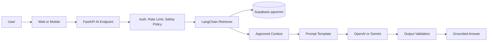

# AI Architecture

## Purpose

This document defines how AI capabilities are integrated into Smart Barangay.

## Overview

Smart Barangay uses AI to answer resident and staff questions from approved barangay knowledge sources. AI does not approve requests, issue documents, change records, or make official decisions. LangChain orchestrates retrieval, prompt assembly, model calls, safety checks, and response formatting.

## Architecture

## Implementation Details

AI components:

| Component | Responsibility |
| --- | --- |
| Knowledge ingestion | Converts approved documents into chunks and embeddings |
| Retriever | Finds relevant chunks from pgvector |
| Prompt template | Gives the model role, constraints, context, and output rules |
| LLM provider adapter | Calls OpenAI or Gemini through a controlled interface |
| Conversation memory | Stores bounded chat history and retrieval metadata |
| Safety layer | Filters unsafe requests, prompt injection attempts, and unsupported answers |
| Audit logging | Records AI usage metadata without exposing sensitive content unnecessarily |

## Design Decisions

RAG is selected over pure model knowledge because barangay policies, procedures, announcements, and service requirements are local and change over time. The model must answer from approved sources and state when information is unavailable.

## Advantages

- Reduces repetitive information requests.
- Grounds answers in local documents.
- Allows knowledge updates without retraining a model.
- Keeps official decisions under human staff control.

## Disadvantages

- Retrieval quality depends on document quality and chunking.
- LLM answers can still be incomplete or overconfident without guardrails.
- Provider cost and latency must be monitored.

## Security Considerations

AI must not expose private resident records unless the request is authenticated, authorized, and intentionally designed for that workflow. Knowledge documents must be approved before indexing. Prompt injection instructions inside uploaded documents must be treated as untrusted content.

## Performance Considerations

AI endpoints should use timeouts, retries, streaming where helpful, and response caching only for public non-sensitive answers. Retrieval should limit chunk count and token size.

## Future Improvements

- Add citations with source document names and sections.
- Add answer quality review tooling for admins.
- Add multilingual responses.
- Add offline evaluation datasets for AI regression testing.

## References

- [RAG_PIPELINE.md](RAG_PIPELINE.md)
- [KNOWLEDGE_BASE.md](KNOWLEDGE_BASE.md)
- [VECTOR_DATABASE.md](VECTOR_DATABASE.md)
- [PROMPT_ENGINEERING.md](PROMPT_ENGINEERING.md)

