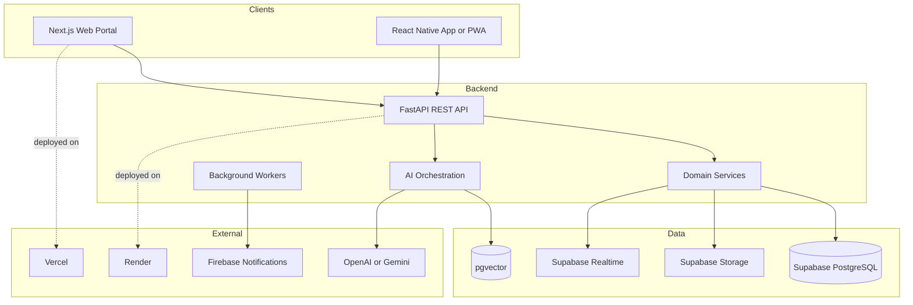

# Architecture

## Purpose

This document defines the target architecture for Smart Barangay and explains how the web, mobile, backend, database, AI, notification, and deployment components work together.

## Overview

Smart Barangay uses a modular service-oriented architecture with a Next.js web portal, a mobile/PWA client, a FastAPI backend, Supabase PostgreSQL, LangChain RAG, and Firebase Cloud Messaging. The backend owns business rules and exposes REST APIs. Supabase stores relational data, files, auth identities, realtime events, and vector embeddings.

## Architecture

## Implementation Details

The backend should be organized using Clean Architecture:

| Layer | Responsibility |
| --- | --- |
| API layer | FastAPI routers, request validation, response serialization |
| Application layer | Use cases such as creating requests, approving certificates, sending notifications |
| Domain layer | Entities, policy rules, role checks, state transitions |
| Infrastructure layer | Supabase, SQLAlchemy repositories, Firebase, AI providers, storage adapters |

Frontend clients should not directly mutate database tables. They authenticate with Supabase Auth, call backend APIs, and subscribe only to approved realtime channels. AI requests pass through the backend so prompts, retrieval, rate limits, audit logging, and safety policies remain enforceable.

## Design Decisions

Supabase is selected because it provides PostgreSQL, Auth, Storage, Realtime, Row Level Security, and pgvector in one managed platform. FastAPI is selected for typed Python APIs and clean integration with LangChain. Next.js is selected for a responsive administrative portal with server-side and client-side rendering options. Firebase is used for mobile push notification delivery because it is reliable across Android and browser environments.

## Advantages

- Clear separation between UI, business logic, persistence, AI, and infrastructure.
- PostgreSQL remains the source of truth for operational data.
- RAG is isolated from transactional workflows while still integrated through controlled APIs.
- Deployment responsibilities are simple: frontend on Vercel, backend on Render, database on Supabase.

## Disadvantages

- Multiple managed services increase configuration and monitoring scope.
- RAG quality depends on document quality, chunking, embeddings, and retrieval controls.
- Supabase RLS requires careful policy design to avoid accidental overexposure.
- Mobile push delivery depends on Firebase token lifecycle management.

## Security Considerations

Every privileged workflow must enforce both API-level authorization and database-level RLS where feasible. Resident PII must be encrypted in transit, access-controlled at rest, audited on read/write, and excluded from AI prompts unless specifically required and redacted. Service-role keys must never be exposed to frontend clients.

## Performance Considerations

Transactional endpoints should use indexed queries and avoid unbounded joins. AI endpoints should be asynchronous where practical, cache reusable retrieval results, and enforce token and rate limits. Realtime subscriptions should be scoped to barangay staff dashboards and resident-specific updates.

## Future Improvements

- Add background task queues for document ingestion, notifications, and report generation.
- Introduce an API gateway or edge middleware if traffic grows.
- Add read replicas or caching for public announcements and static reference data.
- Add service-level objectives for latency, availability, and AI answer quality.

## References

- [SYSTEM_DESIGN.md](SYSTEM_DESIGN.md)
- [BACKEND_ARCHITECTURE.md](BACKEND_ARCHITECTURE.md)
- [FRONTEND_ARCHITECTURE.md](FRONTEND_ARCHITECTURE.md)
- [AI_ARCHITECTURE.md](AI_ARCHITECTURE.md)

