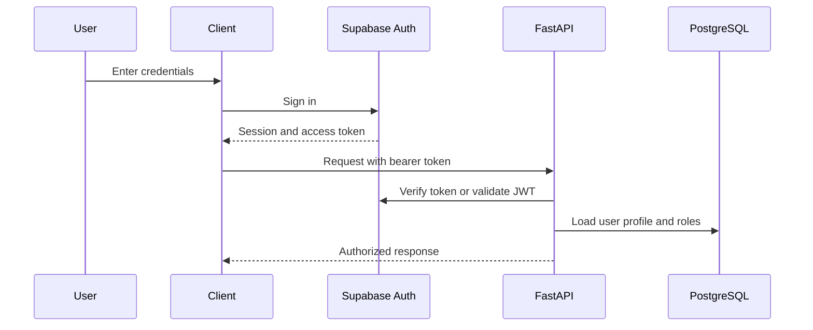

# Authentication

## Purpose

This document explains how Smart Barangay verifies user identity.

## Overview

Smart Barangay uses Supabase Auth as the primary identity provider. Users authenticate through supported email, password, OTP, or approved OAuth flows. The backend validates authenticated requests before executing protected workflows.

## Architecture

## Implementation Details

Authentication requirements:

| Requirement | Implementation |
| --- | --- |
| Token transport | `Authorization: Bearer <access_token>` |
| Session refresh | Client uses Supabase session refresh mechanisms |
| Profile provisioning | On first login, create or complete `user_profiles` record |
| Password recovery | Use Supabase recovery flow |
| Staff onboarding | Admin creates or approves staff profile and role assignment |
| Device registration | Authenticated client registers Firebase token after login |

## Design Decisions

Supabase Auth is used to avoid implementing custom password storage and token issuance. The backend still loads application profiles and roles because identity alone does not define authorization.

## Advantages

- Reduces security risk from custom authentication.
- Integrates with RLS policies.
- Supports future login method expansion.

## Disadvantages

- Requires careful client session handling.
- Auth provider outages affect login.
- Staff approval workflows still require application-level controls.

## Security Considerations

Access tokens must be stored securely by clients. Service-role keys must never be bundled into frontend code. Token verification must reject expired, malformed, or wrong-project tokens. Account recovery should avoid exposing whether sensitive resident records exist.

## Performance Considerations

Backend token verification should use efficient JWT validation and cache public keys when applicable. Profile and role lookup should be indexed and may be cached for short durations if role changes invalidate sessions or caches.

## Future Improvements

- Add MFA for staff and administrators.
- Add device/session management UI.
- Add suspicious login alerts.
- Add staff account lifecycle automation.

## References

- [AUTHORIZATION.md](AUTHORIZATION.md)
- [SECURITY.md](SECURITY.md)
- [DATABASE_SCHEMA.md](DATABASE_SCHEMA.md)
- [API_REFERENCE.md](API_REFERENCE.md)

