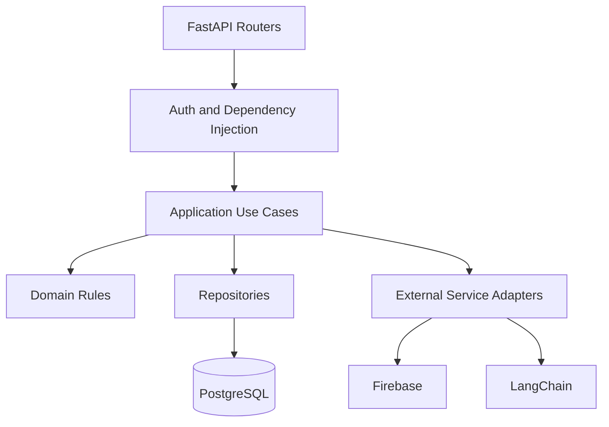

# Backend Architecture

## Purpose

This document defines the backend architecture for Smart Barangay.

## Overview

The backend uses FastAPI with Clean Architecture. It exposes REST APIs, validates requests with Pydantic, executes use cases, persists through SQLAlchemy repositories, integrates with Supabase, orchestrates AI workflows, sends notifications, and emits audit logs.

## Architecture

## Implementation Details

Recommended backend package boundaries:

| Package | Responsibility |
| --- | --- |
| `api/` | Routers, dependencies, error mapping |
| `schemas/` | Pydantic request and response models |
| `application/` | Use cases and transactions |
| `domain/` | Entities, value objects, policies |
| `infrastructure/` | Database, Supabase, Firebase, LLM providers |
| `core/` | Settings, logging, security helpers |
| `tests/` | Unit, integration, and API tests |

## Design Decisions

Business logic lives outside routers so workflows can be tested without HTTP. Repositories abstract persistence while still allowing SQL optimization where necessary. External providers are wrapped in adapters to support provider changes.

## Advantages

- Testable and maintainable backend modules.
- Clear boundaries between business rules and infrastructure.
- Easier replacement of external services.

## Disadvantages

- More structure than a simple CRUD API.
- Requires consistent dependency injection patterns.
- Repository abstractions must not hide important database behavior.

## Security Considerations

Every router dependency must resolve the authenticated actor and enforce permissions inside use cases. Backend logs must include request IDs but not sensitive payloads. Database transactions must preserve audit writes for sensitive changes.

## Performance Considerations

Use async I/O where library support is stable. Avoid N+1 queries. Add indexes before deploying high-volume filters. Move AI ingestion, exports, and notifications to background jobs when they exceed interactive latency.

## Future Improvements

- Add background worker service.
- Add OpenTelemetry tracing.
- Add generated API client artifacts.
- Add service-level integration tests with Supabase local development.

## References

- [SYSTEM_DESIGN.md](SYSTEM_DESIGN.md)
- [API_REFERENCE.md](API_REFERENCE.md)
- [ERROR_HANDLING.md](ERROR_HANDLING.md)
- [DEVOPS.md](DEVOPS.md)

