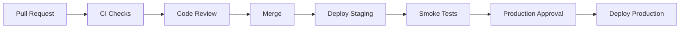

# CI/CD

## Purpose

This document defines continuous integration and continuous delivery practices for Smart Barangay.

## Overview

CI/CD must validate code quality, tests, security, database migrations, and documentation before changes are merged or deployed. Production releases should be controlled, observable, and reversible.

## Architecture

## Implementation Details

Recommended checks:

| Check | Scope |
| --- | --- |
| Type check | TypeScript and Python typing where configured |
| Lint/format | Frontend, backend, Markdown |
| Unit tests | Domain rules and utility functions |
| API tests | FastAPI routes and authorization |
| Migration check | Alembic upgrade validation |
| Security scan | Dependencies and secrets |
| Docs check | Required docs updated for changed areas |

## Design Decisions

Pull requests should be validated before merge. Production deployment should follow successful staging deployment. Database migrations should be reviewed as release artifacts.

## Advantages

- Catches regressions early.
- Creates repeatable release process.
- Improves confidence in deployments.

## Disadvantages

- Initial setup takes effort.
- Slow pipelines can reduce developer velocity.
- Security scanning may need tuning to reduce noise.

## Security Considerations

CI secrets must be limited to required jobs. Forked pull requests should not receive production secrets. Logs must not print tokens, database URLs, or service keys.

## Performance Considerations

Use dependency caching, path filters, parallel jobs, and incremental checks. Full end-to-end tests can run on staging or scheduled pipelines if too slow for every pull request.

## Future Improvements

- Add preview deployments for web changes.
- Add generated OpenAPI diff checks.
- Add migration rollback rehearsal.
- Add deployment provenance records.

## References

- [DEVOPS.md](DEVOPS.md)
- [DEPLOYMENT_GUIDE.md](DEPLOYMENT_GUIDE.md)
- [TESTING_GUIDE.md](TESTING_GUIDE.md)
- [CHANGELOG.md](CHANGELOG.md)

