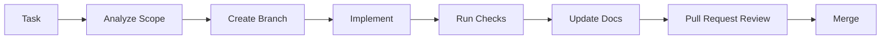

# Contributing

## Purpose

This document defines how contributors should work on Smart Barangay.

## Overview

Contributors must work task-by-task, understand affected modules, implement maintainable changes, validate logic, update documentation, and avoid marking work complete until code and tests are done.

## Architecture

Contribution workflow:

## Implementation Details

Contributor checklist:

- Identify affected files, modules, APIs, and database tables.
- Preserve existing architecture boundaries.
- Use TypeScript and Python typing.
- Add or update tests for changed behavior.
- Update documentation for API, database, AI, deployment, and architecture changes.
- Run relevant validation commands before review.
- Describe risk, rollback notes, and verification results in the pull request.

## Design Decisions

The contribution process emphasizes traceability because the project handles government service records. Documentation updates are part of implementation, not optional cleanup.

## Advantages

- Keeps changes reviewable.
- Reduces regressions and undocumented behavior.
- Supports onboarding and long-term maintenance.

## Disadvantages

- Adds process overhead for small changes.
- Requires contributors to understand documentation ownership.
- Review quality depends on consistent standards.

## Security Considerations

Contributors must not commit secrets, production data, unredacted logs, or resident PII. Security-sensitive changes require focused review of authorization, validation, logging, and audit behavior.

## Performance Considerations

Contributors should consider query cost, payload size, rendering cost, and AI token usage when changing hot paths. Performance-sensitive changes should include measurements or a validation plan.

## Future Improvements

- Add pull request templates.
- Add issue templates by work type.
- Add CODEOWNERS after maintainers are assigned.
- Add automated documentation checks.

## References

- [CODING_STANDARDS.md](CODING_STANDARDS.md)
- [DEVELOPMENT_GUIDE.md](DEVELOPMENT_GUIDE.md)
- [TESTING_GUIDE.md](TESTING_GUIDE.md)
- [CHANGELOG.md](CHANGELOG.md)
