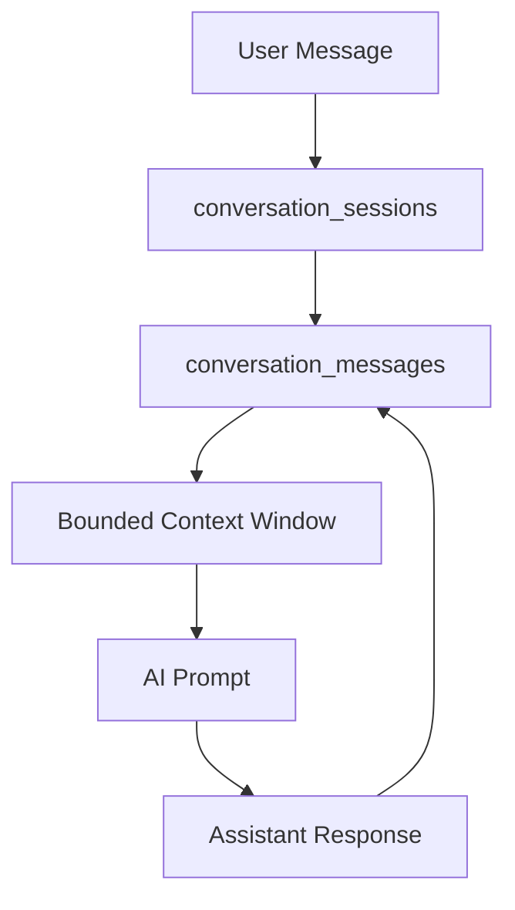

# Conversation Memory

## Purpose

This document defines how Smart Barangay stores and uses AI conversation history.

## Overview

Conversation memory provides context across turns in an AI chat session while preserving privacy and controlling token usage. It must not become an uncontrolled store of sensitive resident data.

## Architecture

## Implementation Details

Conversation storage should include session owner, channel, message role, message content, created timestamp, prompt version, retrieval chunk IDs, model name, token usage, and safety outcome. Context windows should include recent relevant messages only, not entire historical conversations.

## Design Decisions

Memory is session-scoped and bounded. The assistant should prefer retrieved knowledge over user-provided claims when answering official barangay questions. Long-term personalization is deferred until privacy requirements are approved.

## Advantages

- Improves multi-turn usability.
- Supports answer quality review and debugging.
- Preserves retrieval traceability.

## Disadvantages

- Stores potentially sensitive user text.
- Increases database volume.
- Requires retention and deletion policies.

## Security Considerations

Conversation records must be private to the owner and authorized staff only when policy permits support review. PII should be minimized, redacted where possible, and excluded from prompts when not needed. Retention periods must be defined before production launch.

## Performance Considerations

Limit memory loaded into prompts. Index sessions by owner and updated timestamp. Archive or delete old sessions according to retention rules.

## Future Improvements

- Add user-controlled conversation deletion.
- Add summarization for long support sessions.
- Add privacy filters before persistence.
- Add admin review tooling with redaction.

## References

- [AI_ARCHITECTURE.md](AI_ARCHITECTURE.md)
- [PROMPT_ENGINEERING.md](PROMPT_ENGINEERING.md)
- [DATABASE_SCHEMA.md](DATABASE_SCHEMA.md)
- [SECURITY.md](SECURITY.md)
