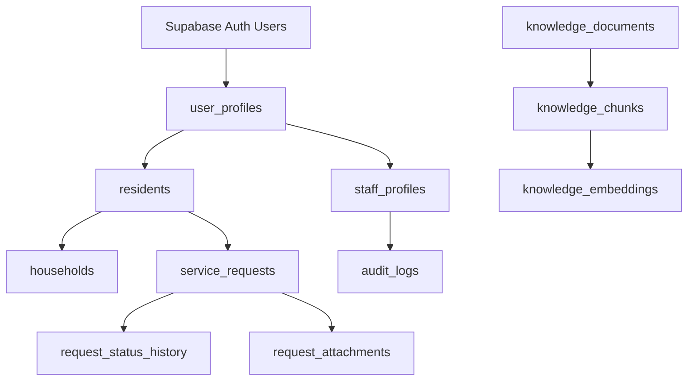

# Database Design

## Purpose

This document defines the database design principles, table groupings, ownership rules, and persistence strategy for Smart Barangay.

## Overview

Supabase PostgreSQL is the system of record for resident profiles, service requests, staff workflows, announcements, notifications, audit logs, files, and AI knowledge metadata. The database must preserve relational integrity while supporting secure multi-role access through Row Level Security.

## Architecture

## Implementation Details

Table groups:

| Group | Tables |
| --- | --- |
| Identity | `user_profiles`, `resident_profiles`, `staff_profiles`, `roles`, `permissions`, `role_permissions` |
| Barangay records | `households`, `household_members`, `addresses`, `resident_documents` |
| Services | `service_categories`, `service_types`, `service_requests`, `request_status_history`, `request_attachments`, `request_comments` |
| Communications | `announcements`, `notification_templates`, `notifications`, `device_tokens` |
| AI knowledge | `knowledge_documents`, `knowledge_chunks`, `knowledge_embeddings`, `conversation_sessions`, `conversation_messages` |
| Governance | `audit_logs`, `system_settings`, `report_exports` |

Use UUID primary keys, `created_at`, `updated_at`, and nullable `deleted_at` where soft deletion is needed. Use foreign keys for ownership and lifecycle relationships. Use check constraints for finite status values.

## Design Decisions

PostgreSQL is used for both transactional and vector workloads to reduce data movement. RLS should guard resident-owned records and staff-only resources. Application-level authorization remains required because business rules such as request state transitions exceed simple row ownership.

## Advantages

- Strong relational integrity for government records.
- RLS adds a database-level protection boundary.
- pgvector keeps semantic search close to approved knowledge documents.
- Supabase Storage integrates with database-owned attachment metadata.

## Disadvantages

- RLS policies are easy to misconfigure without tests.
- Combining transactional and vector workloads requires query discipline.
- Reporting queries may need materialized views as data grows.

## Security Considerations

Sensitive tables must use RLS. Attachments should be private by default and accessed through signed URLs or backend-mediated downloads. Audit logs should be append-only for normal application roles.

## Performance Considerations

Create indexes for foreign keys, request status filters, `created_at`, staff assignment, resident ownership, and vector similarity search. Use pagination for all user-facing lists. Avoid unbounded JSONB filtering unless indexed.

## Future Improvements

- Add database-level audit triggers for high-risk tables.
- Add materialized views for reporting dashboards.
- Add automated schema drift checks in CI.
- Add data retention policies by record type.

## References

- [DATABASE_SCHEMA.md](DATABASE_SCHEMA.md)
- [ENTITY_RELATIONSHIP.md](ENTITY_RELATIONSHIP.md)
- [AUTHORIZATION.md](AUTHORIZATION.md)
- [VECTOR_DATABASE.md](VECTOR_DATABASE.md)

