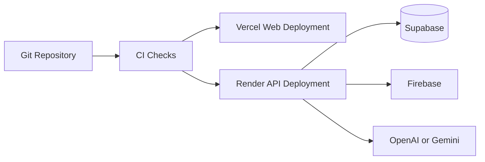

# Deployment Guide

## Purpose

This document defines how Smart Barangay should be deployed across frontend, backend, database, and supporting services.

## Overview

The target deployment uses Vercel for the Next.js frontend, Render for the FastAPI backend, Supabase for PostgreSQL/Auth/Storage/Realtime/pgvector, and Firebase for push notifications.

## Architecture

## Implementation Details

Deployment steps:

| Step | Action |
| --- | --- |
| 1 | Configure environment variables per environment |
| 2 | Run database migrations against target Supabase project |
| 3 | Deploy backend to Render |
| 4 | Deploy frontend to Vercel |
| 5 | Validate health checks, auth, API access, storage, notifications, and AI |
| 6 | Monitor logs and metrics after release |

Use separate projects or environments for development, staging, and production.

## Design Decisions

Managed hosting minimizes server administration while preserving clear deployment boundaries. Database migrations should be explicit release steps, not hidden side effects of application startup.

## Advantages

- Simple operational model.
- Good fit for small teams.
- Clear ownership per platform.

## Disadvantages

- Service limits and pricing must be monitored.
- Cross-platform environment configuration can drift.
- Rollbacks involving schema changes require planning.

## Security Considerations

Production secrets must be configured only in platform secret stores. Use least-privilege keys. Restrict Supabase dashboard access. Validate CORS origins and callback URLs per environment.

## Performance Considerations

Choose deployment regions close to expected users. Avoid cold-start-sensitive workflows where possible. Configure backend health checks and keep AI calls behind timeouts.

## Future Improvements

- Add blue-green or canary deployment strategy.
- Add automated migration verification.
- Add deployment smoke tests.
- Add disaster recovery documentation with RTO/RPO targets.

## References

- [DEVOPS.md](DEVOPS.md)
- [CI_CD.md](CI_CD.md)
- [DOCKER.md](DOCKER.md)
- [MONITORING.md](MONITORING.md)

