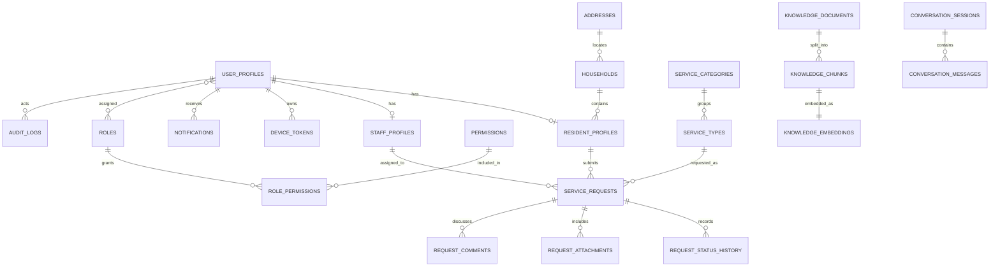

# Entity Relationship

## Purpose

This document describes the major entities and relationships in the Smart Barangay data model.

## Overview

The entity model connects authenticated users to resident or staff profiles, links residents to households, tracks service requests and status history, and stores AI knowledge documents separately from operational records.

## Architecture

## Implementation Details

Relationship rules:

| Relationship | Rule |
| --- | --- |
| User to profile | A user may be a resident, staff member, or both only if explicitly authorized. |
| Household to resident | A resident belongs to one current household; history can be added later. |
| Resident to request | A request must have one submitting resident unless created by staff as assisted service. |
| Request to status history | Every status change must create one history entry. |
| Knowledge document to chunks | Only approved documents should be retrievable by AI. |
| Conversation to messages | Messages must preserve role, content, timestamp, and retrieval metadata. |

## Design Decisions

The model separates `user_profiles` from `resident_profiles` and `staff_profiles` because authentication identity is not the same as civic or employment identity. This supports staff who are also residents and keeps role assignment independent from demographic records.

## Advantages

- Supports clear ownership and authorization boundaries.
- Preserves request history for audit and reporting.
- Keeps AI knowledge data isolated from operational records.

## Disadvantages

- Profile separation introduces extra joins.
- Household modeling may need refinement for complex family arrangements.
- ERD must evolve as service-specific workflows are implemented.

## Security Considerations

Relationship traversal must respect the current actor. A staff user assigned to a request may need access to attachments for that request, but not to unrelated household records. RLS policies should encode ownership and staff scopes carefully.

## Performance Considerations

Indexes are required on relationship columns such as `resident_profile_id`, `household_id`, `service_request_id`, `assigned_staff_id`, and `knowledge_document_id`. Dashboard queries should avoid N+1 loading of related rows.

## Future Improvements

- Add household history and address history if migration tracking is required.
- Add document issuance entities for signed certificates.
- Add organization units for larger barangay office structures.
- Add generated ERD updates from migrations.

## References

- [DATABASE_DESIGN.md](DATABASE_DESIGN.md)
- [DATABASE_SCHEMA.md](DATABASE_SCHEMA.md)
- [AUTHORIZATION.md](AUTHORIZATION.md)
- [RAG_PIPELINE.md](RAG_PIPELINE.md)

