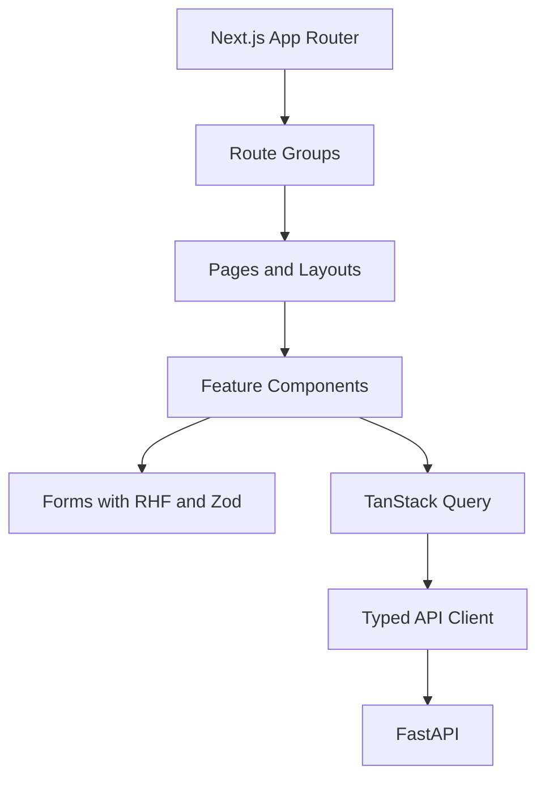

# Frontend Architecture

## Purpose

This document defines the frontend architecture for the Smart Barangay web portal.

## Overview

The web portal uses Next.js, React, TypeScript, Tailwind CSS, Shadcn UI, React Hook Form, TanStack Query, and Zod. It serves residents, staff, supervisors, and administrators through role-aware layouts and feature modules.

## Architecture

## Implementation Details

Recommended structure:

| Area | Responsibility |
| --- | --- |
| `app/` | Routes, layouts, loading states, server components when appropriate |
| `components/ui/` | Reusable Shadcn-based primitives |
| `features/` | Domain features such as requests, announcements, reports, AI chat |
| `lib/api/` | API client and generated types |
| `lib/auth/` | Supabase session helpers and route guards |
| `schemas/` | Zod schemas shared by forms and request validation |

## Design Decisions

Use feature-based organization for domain workflows and reusable primitives for UI consistency. TanStack Query owns server state, while local component state is reserved for UI-only interactions. Zod schemas should align with backend Pydantic contracts.

## Advantages

- Clear separation between route composition and domain features.
- Strong TypeScript support improves maintainability.
- Form validation stays consistent and testable.

## Disadvantages

- Requires discipline to avoid duplicating API types.
- Client/server rendering choices must be reviewed per route.
- Role-aware UI can become complex without shared guards.

## Security Considerations

Frontend route guards improve UX but are not security boundaries. Protected data must still be authorized by the backend. Tokens must not be logged. Service-role credentials must never appear in client bundles.

## Performance Considerations

Use code splitting through route boundaries, cache server state with clear invalidation, paginate lists, optimize images, and keep mobile views lightweight. Avoid large dashboard payloads on initial load.

## Future Improvements

- Generate typed API client from OpenAPI.
- Add Storybook or equivalent component documentation.
- Add accessibility test coverage.
- Add offline-friendly PWA behavior for selected resident workflows.

## References

- [TECH_STACK.md](TECH_STACK.md)
- [API_REFERENCE.md](API_REFERENCE.md)
- [AUTHENTICATION.md](AUTHENTICATION.md)
- [MOBILE_ARCHITECTURE.md](MOBILE_ARCHITECTURE.md)

