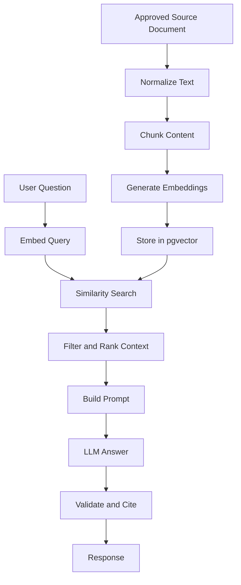

# RAG Pipeline

## Purpose

This document defines the Retrieval-Augmented Generation pipeline for Smart Barangay.

## Overview

The RAG pipeline retrieves approved barangay knowledge and supplies it to an LLM so responses are grounded in local procedures. The pipeline covers ingestion, chunking, embedding, retrieval, prompt assembly, answer generation, and evaluation.

## Architecture

## Implementation Details

Pipeline stages:

| Stage | Implementation Requirement |
| --- | --- |
| Source approval | Admin approves document before ingestion |
| Normalization | Extract text, remove boilerplate, preserve headings |
| Chunking | Split by semantic section with bounded token length |
| Embedding | Generate embeddings using configured provider |
| Storage | Save chunk metadata, content hash, and vector |
| Retrieval | Query by vector similarity and optional metadata filters |
| Prompt assembly | Include only relevant approved chunks |
| Response | Answer concisely, cite sources, state uncertainty |
| Evaluation | Track helpfulness, groundedness, refusal correctness |

## Design Decisions

The pipeline separates ingestion from chat requests so expensive document processing happens asynchronously. Approved-only indexing prevents draft or unverified content from entering resident-facing answers.

## Advantages

- Keeps answers current with local documents.
- Supports transparent source attribution.
- Enables targeted reindexing when documents change.

## Disadvantages

- Requires ongoing knowledge-base maintenance.
- Poor chunking can reduce retrieval accuracy.
- Embedding model changes may require reindexing.

## Security Considerations

Uploaded documents are untrusted until approved. Retrieval must filter by document status and audience. Staff-only knowledge must not be returned to residents. Prompt instructions inside document text must not override system policy.

## Performance Considerations

Use background jobs for ingestion. Keep top-k retrieval bounded. Add vector indexes after data volume grows. Cache embeddings for identical content hashes.

## Future Improvements

- Add hybrid keyword plus vector search.
- Add reranking for high-value answers.
- Add automated stale document detection.
- Add evaluation reports for answer quality.

## References

- [AI_ARCHITECTURE.md](AI_ARCHITECTURE.md)
- [KNOWLEDGE_BASE.md](KNOWLEDGE_BASE.md)
- [VECTOR_DATABASE.md](VECTOR_DATABASE.md)
- [PROMPT_ENGINEERING.md](PROMPT_ENGINEERING.md)

