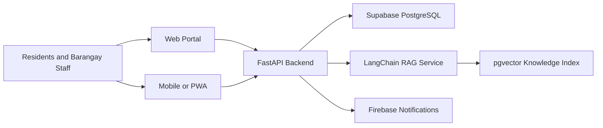

# Smart Barangay Documentation

## Purpose

This directory is the engineering documentation hub for Smart Barangay, an AI-powered web and mobile services portal for Barangay Tandang Sora, Butuan City. It gives engineers, administrators, and maintainers a shared source of truth for how the platform is planned, built, secured, deployed, and operated.

## Overview

Smart Barangay modernizes resident services by combining a Next.js portal, a mobile/PWA experience, a FastAPI backend, Supabase PostgreSQL, Firebase notifications, and LangChain-based Retrieval-Augmented Generation. The platform supports service requests, resident records, announcements, certificate processing, knowledge-base search, AI assistance, notifications, reports, and administrative workflows.

## Architecture

The documentation is organized by engineering concern:

| Area | Primary Documents |
| --- | --- |
| Product and requirements | [BUSINESS_REQUIREMENTS.md](BUSINESS_REQUIREMENTS.md), [SOFTWARE_REQUIREMENTS_SPECIFICATION.md](SOFTWARE_REQUIREMENTS_SPECIFICATION.md), [FUNCTIONAL_REQUIREMENTS.md](FUNCTIONAL_REQUIREMENTS.md), [NON_FUNCTIONAL_REQUIREMENTS.md](NON_FUNCTIONAL_REQUIREMENTS.md) |
| System architecture | [ARCHITECTURE.md](ARCHITECTURE.md), [SYSTEM_OVERVIEW.md](SYSTEM_OVERVIEW.md), [SYSTEM_DESIGN.md](SYSTEM_DESIGN.md), [TECH_STACK.md](TECH_STACK.md) |
| Data and API | [DATABASE_DESIGN.md](DATABASE_DESIGN.md), [DATABASE_SCHEMA.md](DATABASE_SCHEMA.md), [ENTITY_RELATIONSHIP.md](ENTITY_RELATIONSHIP.md), [API_REFERENCE.md](API_REFERENCE.md) |
| Identity and security | [AUTHENTICATION.md](AUTHENTICATION.md), [AUTHORIZATION.md](AUTHORIZATION.md), [SECURITY.md](SECURITY.md) |
| AI and RAG | [AI_ARCHITECTURE.md](AI_ARCHITECTURE.md), [RAG_PIPELINE.md](RAG_PIPELINE.md), [KNOWLEDGE_BASE.md](KNOWLEDGE_BASE.md), [VECTOR_DATABASE.md](VECTOR_DATABASE.md), [PROMPT_ENGINEERING.md](PROMPT_ENGINEERING.md), [CONVERSATION_MEMORY.md](CONVERSATION_MEMORY.md) |
| Application layers | [FRONTEND_ARCHITECTURE.md](FRONTEND_ARCHITECTURE.md), [BACKEND_ARCHITECTURE.md](BACKEND_ARCHITECTURE.md), [MOBILE_ARCHITECTURE.md](MOBILE_ARCHITECTURE.md), [PROJECT_STRUCTURE.md](PROJECT_STRUCTURE.md) |
| Delivery and operations | [DEVELOPMENT_GUIDE.md](DEVELOPMENT_GUIDE.md), [DEPLOYMENT_GUIDE.md](DEPLOYMENT_GUIDE.md), [DEVOPS.md](DEVOPS.md), [DOCKER.md](DOCKER.md), [CI_CD.md](CI_CD.md), [TESTING_GUIDE.md](TESTING_GUIDE.md) |
| Reliability | [PERFORMANCE.md](PERFORMANCE.md), [SCALABILITY.md](SCALABILITY.md), [MONITORING.md](MONITORING.md), [LOGGING.md](LOGGING.md), [ERROR_HANDLING.md](ERROR_HANDLING.md) |
| Governance | [CODING_STANDARDS.md](CODING_STANDARDS.md), [CONTRIBUTING.md](CONTRIBUTING.md), [ROADMAP.md](ROADMAP.md), [CHANGELOG.md](CHANGELOG.md) |

## Implementation Details

Use this documentation as the baseline contract for implementation. When code is added or changed, update the documents listed in the relevant feature area. API changes must update [API_REFERENCE.md](API_REFERENCE.md). Database changes must update [DATABASE_SCHEMA.md](DATABASE_SCHEMA.md) and [ENTITY_RELATIONSHIP.md](ENTITY_RELATIONSHIP.md). AI changes must update [AI_ARCHITECTURE.md](AI_ARCHITECTURE.md), [RAG_PIPELINE.md](RAG_PIPELINE.md), and [PROMPT_ENGINEERING.md](PROMPT_ENGINEERING.md).

## Design Decisions

The documentation favors implementation-ready decisions over abstract descriptions. Each document explains rationale, security considerations, performance constraints, trade-offs, and future improvements so new engineers can join the project without relying on verbal handoff.

## Advantages

- Creates a clear onboarding path for new contributors.
- Keeps architecture, API, database, AI, and operations decisions discoverable.
- Reduces implementation drift by making system contracts explicit.
- Supports government-grade accountability and maintainability.

## Disadvantages

- Documentation must be maintained continuously or it becomes misleading.
- Some baseline contracts may require adjustment when implementation starts.
- Detailed documents increase review scope for each architectural change.

## Security Considerations

Documentation must not include production secrets, private keys, access tokens, real resident personal data, or unredacted incident records. Security-sensitive procedures should describe required controls without exposing exploitable configuration values.

## Performance Considerations

Performance requirements are documented early so frontend, backend, database, and AI decisions can be evaluated against measurable targets. See [PERFORMANCE.md](PERFORMANCE.md) and [SCALABILITY.md](SCALABILITY.md).

## Future Improvements

- Add ADRs for major architectural decisions once implementation begins.
- Generate OpenAPI documentation from backend route definitions.
- Add schema diagrams from Supabase migrations.
- Add runbooks for common operational incidents.

## References

- [ARCHITECTURE.md](ARCHITECTURE.md)
- [SYSTEM_OVERVIEW.md](SYSTEM_OVERVIEW.md)
- [DEVELOPMENT_GUIDE.md](DEVELOPMENT_GUIDE.md)
- [CHANGELOG.md](CHANGELOG.md)

