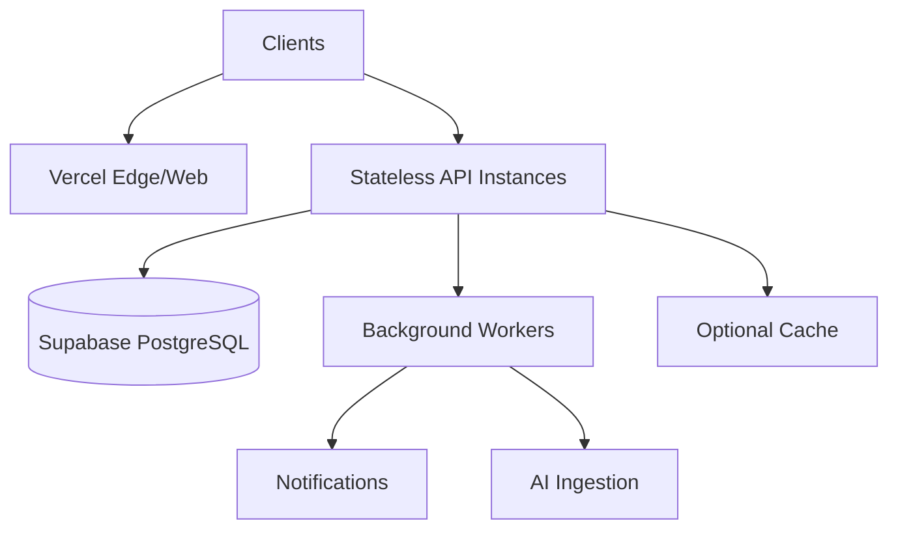

# Scalability

## Purpose

This document defines how Smart Barangay can scale as usage, data volume, and feature complexity grow.

## Overview

The initial deployment should support barangay-scale usage with managed services. Scalability planning focuses on database query efficiency, asynchronous workloads, stateless API instances, bounded realtime subscriptions, and AI cost control.

## Architecture

## Implementation Details

Scalability practices:

| Concern | Practice |
| --- | --- |
| API | Keep instances stateless and horizontally scalable |
| Database | Index hot paths and avoid unbounded reports |
| Background jobs | Move ingestion, notification, and exports off request path |
| Realtime | Subscribe only to scoped channels |
| AI | Limit tokens, cache public answers, monitor cost |
| Storage | Use private buckets and lifecycle policies |

## Design Decisions

Scale the simplest reliable component first. For early barangay workloads, database indexing and async jobs will likely provide more benefit than complex distributed systems.

## Advantages

- Keeps architecture practical for a small team.
- Provides clear paths for growth.
- Avoids unnecessary infrastructure before real demand.

## Disadvantages

- Managed service limits may require plan upgrades.
- Background job infrastructure adds operational responsibility.
- Realtime and AI costs can grow unexpectedly.

## Security Considerations

Scaling must not weaken authorization. Caches, workers, and replicas must preserve data access controls. Background jobs using elevated credentials must be narrowly scoped and audited.

## Performance Considerations

Track queue depth, API latency, database CPU, slow queries, vector search latency, notification delivery time, and AI token usage. Add capacity only after metrics identify bottlenecks.

## Future Improvements

- Add read replicas if reporting load increases.
- Add queue service for background work.
- Add per-feature rate limits.
- Add tenant or office-unit partitioning if the platform expands beyond one barangay.

## References

- [PERFORMANCE.md](PERFORMANCE.md)
- [DEVOPS.md](DEVOPS.md)
- [DATABASE_DESIGN.md](DATABASE_DESIGN.md)
- [MONITORING.md](MONITORING.md)

