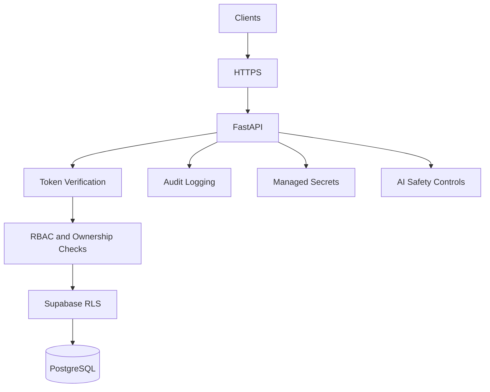

# Security

## Purpose

This document defines the security model and baseline controls for Smart Barangay.

## Overview

Smart Barangay handles resident PII, government service records, attachments, staff actions, AI conversations, and official announcements. Security must protect confidentiality, integrity, availability, accountability, and privacy.

## Architecture

## Implementation Details

Required controls:

| Area | Control |
| --- | --- |
| Transport | HTTPS only in production |
| Authentication | Supabase Auth tokens, staff MFA roadmap |
| Authorization | RBAC, ownership checks, workflow state checks, RLS |
| Input handling | Pydantic/Zod validation and output encoding |
| File uploads | Type, size, ownership, malware scanning strategy, private buckets |
| Secrets | Environment-managed secrets, no secrets in source |
| Logging | Structured logs without PII or tokens |
| Audit | Append-only audit records for sensitive actions |
| AI | Prompt injection controls, approved retrieval sources, PII minimization |
| Rate limiting | Protect login, AI, uploads, and write endpoints |

## Design Decisions

Security is enforced at multiple layers because no single control is sufficient. The backend is the policy enforcement point for business rules. Supabase RLS is used as a data-access backstop. AI retrieval is limited to approved knowledge documents.

## Advantages

- Reduces risk of unauthorized access and data leakage.
- Creates auditable accountability for staff actions.
- Makes security requirements explicit for implementation and QA.

## Disadvantages

- More controls require more tests and operational discipline.
- Strict RLS can slow development if local fixtures are weak.
- AI safety controls may reduce answer breadth but improve trust.

## Security Considerations

High-risk threats include broken access control, insecure direct object references, leaked service keys, unsafe file uploads, prompt injection, excessive data in logs, and accidental public bucket exposure. These must be tested before production release.

## Performance Considerations

Security checks should be efficient and request-scoped. Rate limiting and audit writes must not become bottlenecks. Expensive scanning or export operations should be asynchronous.

## Future Improvements

- Add threat model documents per major workflow.
- Add automated dependency scanning.
- Add secret scanning in CI.
- Add incident response runbooks and recovery drills.

## References

- [AUTHENTICATION.md](AUTHENTICATION.md)
- [AUTHORIZATION.md](AUTHORIZATION.md)
- [LOGGING.md](LOGGING.md)
- [ERROR_HANDLING.md](ERROR_HANDLING.md)
