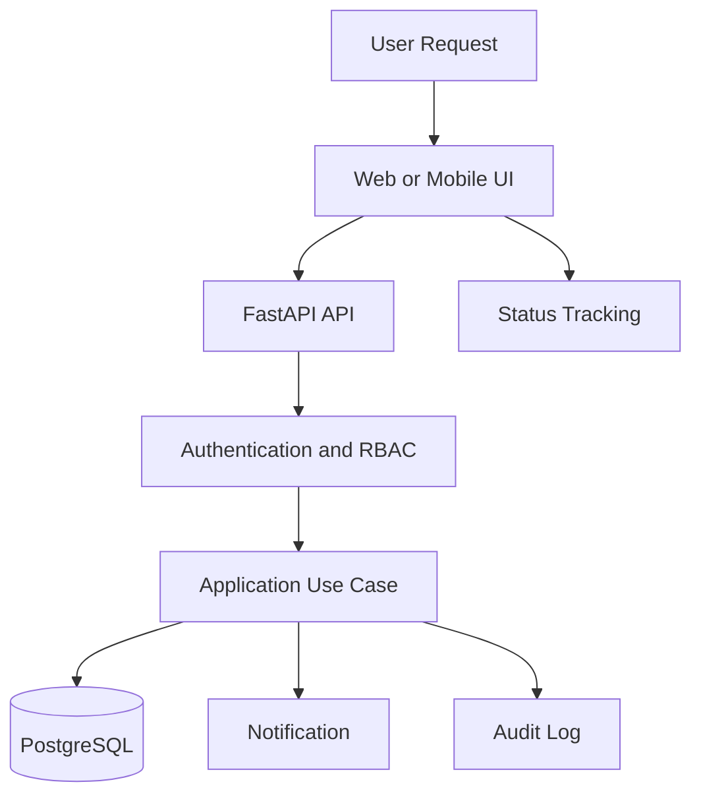

# Software Requirements Specification

## Purpose

This SRS defines the functional scope, constraints, interfaces, quality attributes, and acceptance expectations for Smart Barangay.

## Overview

Smart Barangay provides authenticated resident services, staff workflows, AI-assisted information retrieval, notifications, reporting, and secure records management. It must be suitable for a production-grade local government environment.

## Architecture

## Implementation Details

| Requirement Category | Requirement |
| --- | --- |
| User management | Residents and staff must authenticate before accessing protected data. |
| Service requests | Residents must create, view, and track requests with required supporting data. |
| Staff workflow | Staff must review, assign, approve, reject, and complete requests. |
| AI assistant | Users may ask questions answered from approved knowledge-base content. |
| Notifications | Users receive relevant status, announcement, and alert notifications. |
| Reporting | Staff can view request volume, processing time, and status reports. |
| Auditability | Sensitive operations must create immutable audit entries. |

## Design Decisions

The SRS treats APIs and database schemas as contracts. Client applications must not bypass backend business rules. AI responses are advisory and must cite or trace back to approved knowledge-base documents where possible.

## Advantages

- Provides a testable implementation baseline.
- Separates product requirements from architecture details.
- Creates clear acceptance criteria for feature delivery.

## Disadvantages

- Requirements may evolve as barangay workflows are validated.
- Some integrations depend on third-party service availability.
- Legal policy may affect retention, document issuance, and identity verification flows.

## Security Considerations

The SRS requires authentication, authorization, audit logging, input validation, upload scanning strategy, rate limits, and secure secrets management. See [SECURITY.md](SECURITY.md) for detailed controls.

## Performance Considerations

The system should target responsive UI interactions under normal network conditions, bounded API latency for common operations, asynchronous processing for long tasks, and pagination for all list endpoints.

## Future Improvements

- Convert requirements to tracked issues and acceptance tests.
- Add OpenAPI-generated contract tests.
- Add traceability from requirements to implementation and test cases.
- Add accessibility acceptance criteria per screen.

## References

- [FUNCTIONAL_REQUIREMENTS.md](FUNCTIONAL_REQUIREMENTS.md)
- [NON_FUNCTIONAL_REQUIREMENTS.md](NON_FUNCTIONAL_REQUIREMENTS.md)
- [TESTING_GUIDE.md](TESTING_GUIDE.md)
- [API_REFERENCE.md](API_REFERENCE.md)

