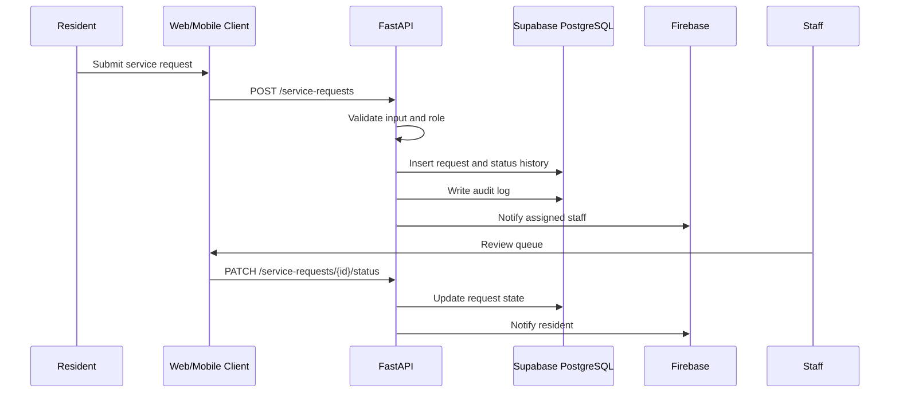

# System Design

## Purpose

This document describes the detailed system design for Smart Barangay workflows, boundaries, and data movement.

## Overview

The system design centers on authenticated service workflows, reliable data persistence, controlled AI retrieval, and event-driven notifications. Clients submit requests through REST APIs, the backend validates and coordinates use cases, PostgreSQL stores authoritative records, and notification/AI services support user experience without replacing core business rules.

## Architecture

## Implementation Details

Design components:

| Component | Responsibility |
| --- | --- |
| Client app | Render UI, collect input, call APIs, manage local state |
| API router | Parse requests, validate schema, return consistent responses |
| Use case service | Execute workflow rules and transactions |
| Repository | Encapsulate SQLAlchemy/Supabase persistence |
| Event publisher | Emit notification and realtime events after state changes |
| AI gateway | Apply prompt policy, retrieval, provider calls, and citations |

## Design Decisions

State-changing operations must be handled in backend use cases so validation, authorization, persistence, audit logging, and notifications are consistent. Realtime updates should be emitted after successful commits to avoid showing uncommitted state.

## Advantages

- Makes workflows testable at the use-case level.
- Keeps clients lightweight and consistent.
- Supports future background workers and event processors.

## Disadvantages

- Requires disciplined module boundaries.
- More backend code is needed than direct database access from clients.
- Event delivery must handle retries and duplicate notifications.

## Security Considerations

The backend must check permissions on every request even when Supabase RLS exists. State transitions must validate allowed roles and current status. Audit logging must occur inside the same transaction or an equivalent guaranteed write path.

## Performance Considerations

Use transactional writes for request creation and status changes. Use pagination for queues. Use summary tables or materialized views only after query measurements justify them.

## Future Improvements

- Add outbox pattern for notification reliability.
- Add workflow configuration for new service types.
- Add event stream analytics.
- Add generated sequence diagrams from integration tests.

## References

- [ARCHITECTURE.md](ARCHITECTURE.md)
- [API_REFERENCE.md](API_REFERENCE.md)
- [DATABASE_DESIGN.md](DATABASE_DESIGN.md)
- [ERROR_HANDLING.md](ERROR_HANDLING.md)
