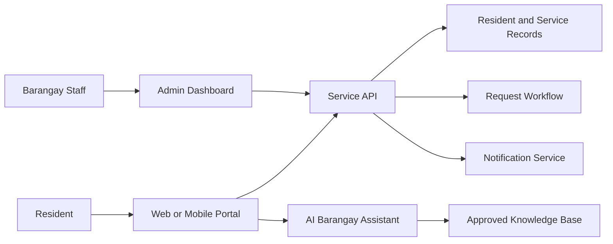

# System Overview

## Purpose

This document explains what Smart Barangay does, who uses it, and how major capabilities fit together.

## Overview

Smart Barangay is a digital services portal for Barangay Tandang Sora, Butuan City. It helps residents request services, track submissions, receive announcements, access AI-assisted information, and communicate with barangay offices. It helps staff manage requests, verify resident records, process certificates, publish updates, monitor workload, and generate operational reports.

## Architecture

## Implementation Details

Core modules should include:

| Module | Description |
| --- | --- |
| Resident services | Online service requests, status tracking, document upload, certificate pickup instructions |
| Barangay administration | Staff dashboard, workflow queues, approvals, verification, reporting |
| Communications | Announcements, alerts, push notifications, email or SMS extension points |
| AI assistant | RAG-based answers from approved policies, procedures, FAQs, ordinances, and service guides |
| Records management | Resident profiles, households, service history, audit logs, attachments |
| Analytics | Volume trends, pending workloads, resolution times, request categories |

## Design Decisions

The system is designed around government service workflows rather than generic ticketing. Residents interact with a simplified portal, while staff receive structured queues and controls. AI answers are grounded in approved knowledge-base content to avoid unsupported guidance.

## Advantages

- Makes barangay service information available outside office hours.
- Reduces manual encoding and repeated questions.
- Improves transparency through status tracking.
- Creates an auditable workflow for staff actions.

## Disadvantages

- Requires careful data governance for resident records.
- Staff adoption and process alignment are required for success.
- Digitized workflows must still support residents without reliable internet access.

## Security Considerations

Resident identity, household data, certificate records, and attachments are sensitive. The system must require authentication for private workflows, implement role-based access for staff, log administrative actions, and restrict public AI answers to non-sensitive knowledge.

## Performance Considerations

Resident-facing pages should load quickly on low-bandwidth mobile connections. Staff dashboards should paginate queues, cache summary cards, and avoid long-running synchronous report generation.

## Future Improvements

- Add kiosk mode for barangay office assisted service.
- Add multilingual support for Cebuano, Filipino, and English content.
- Add offline-capable mobile forms for field staff.
- Add automated workload forecasting.

## References

- [BUSINESS_REQUIREMENTS.md](BUSINESS_REQUIREMENTS.md)
- [FUNCTIONAL_REQUIREMENTS.md](FUNCTIONAL_REQUIREMENTS.md)
- [AUTHORIZATION.md](AUTHORIZATION.md)
- [RAG_PIPELINE.md](RAG_PIPELINE.md)

